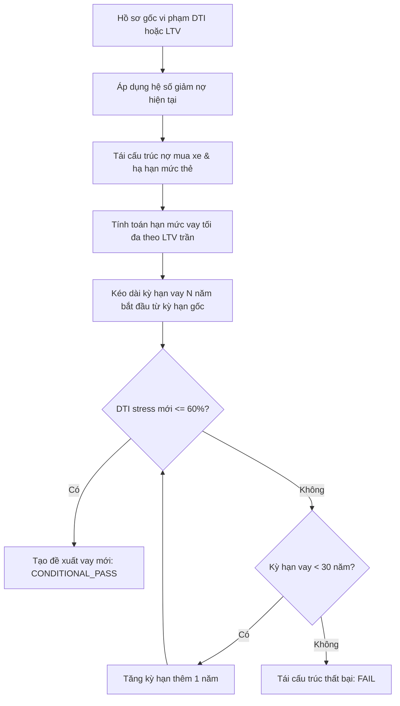
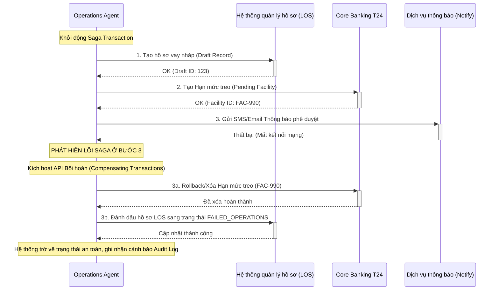

# Báo Cáo Giải Thích Chi Tiết Dự Án: Hệ Thống Thẩm Định Tín Dụng Bán Lẻ Đa Tác Nhân (SHB Retail Credit Multi-Agent System)

Dự án này là một hệ thống **Multi-Agent Neuro-Symbolic AI** hỗ trợ thẩm định và phê duyệt tín dụng bán lẻ thế chấp bất động sản. Khác biệt với các hệ thống chatbot tài chính thông thường hoặc các bộ lọc IF/ELSE truyền thống, hệ thống này được thiết kế như một **Không gian quyết định và thực thi (Decision-and-Execution Workspace)** tích hợp sâu vào hệ thống ngân hàng, vận hành theo nguyên lý **Accuracy-First (Chính xác trên hết)**, **Human Oversight (Sự kiểm soát của con người)**, và **Fail-Closed (Tự động dừng an toàn khi có sự cố)**.

---

## 1. TRIẾT LÝ SẢN PHẨM & CHỈ SỐ ĐO LƯỜNG CỐT LÕI

### 1.1. Triết lý sản phẩm
Hệ thống được thiết kế để giải quyết 5 bài toán thực tế của ngân hàng:
1. **Tối ưu hóa chi phí và tốc độ**: Phê duyệt các hồ sơ sạch ("clean applications") cực kỳ nhanh chóng với chi phí vận hành tối thiểu.
2. **Tận thu giao dịch khả thi**: Thay vì từ chối thẳng các hồ sơ trượt chuẩn, hệ thống tự động tìm kiếm phương án tái cấu trúc nợ và khoản vay an toàn để cứu hồ sơ.
3. **Định giá theo rủi ro (Risk-Adjusted Pricing)**: Định giá lãi suất ưu đãi dựa trên biên độ lợi nhuận rủi ro tối thiểu, bảo vệ biên lợi nhuận của ngân hàng.
4. **Kiểm soát tuân thủ tuyệt đối**: Ngăn chặn rò rỉ tuân thủ pháp lý và các ghi chép sai sót vào Core Banking hạ nguồn.
5. **Phân quyền vai trò người dùng rõ ràng (Least Privilege)**: Cung cấp bằng chứng và quyền hạn thao tác phù hợp nhất cho từng vai trò trong quy trình (RM, Chuyên viên Tín dụng, Người phê duyệt, Quản lý Rủi ro & Tuân thủ, Operations).

### 1.2. Hệ thống chỉ số (Metrics)
* **Chỉ số Bắc Đẩu (North-star Metric)**: **Risk-adjusted profit per completed application** (Lợi nhuận điều chỉnh theo rủi ro trên mỗi hồ sơ hoàn thành).
* **Các chỉ số bổ trợ**:
  * **STP Rate (Straight-Through-Processing)**: Tỷ lệ hồ sơ được duyệt tự động hoàn toàn mà không cần con người can thiệp.
  * **TAT (Turnaround Time)**: Thời gian xử lý một hồ sơ.
  * **Exception & Override Rate**: Tỷ lệ hồ sơ được duyệt ngoài chuẩn hoặc bị con người ghi đè quyết định của AI.
  * **Compliance incident rate**: Tỷ lệ xảy ra lỗi tuân thủ.
  * **Early Delinquency (Nợ xấu sớm)**: Tỷ lệ phát sinh nợ quá hạn trong thời gian đầu sau giải ngân.

---

## 2. KIẾN TRÚC LUỒNG CÔNG VIỆC (WORKFLOWS) & PHÂN LÀN XỬ LÝ

Hệ thống phân chia mọi hồ sơ tín dụng đầu vào thành **3 làn vận hành (Operating Lanes)** riêng biệt dựa trên mức độ rủi ro và tính rõ ràng của dữ liệu:

| Làn xử lý (Lane) | Điều kiện áp dụng (Eligibility) | Độ sâu xử lý AI (AI Depth) | Vai trò con người (Human Gate) | SLA mục tiêu |
| :--- | :--- | :--- | :--- | :--- |
| **Auto Approval** (Phê duyệt tự động) | Mọi kiểm tra quy tắc cứng (auto-policy) đều đạt. Hồ sơ cực kỳ sạch. | Động cơ luật (Rules) + 1 lệnh gọi LLM giải thích. | Con người cấp quyền phê duyệt tự động trước đó. | **< 30 giây** |
| **Hybrid Approval** (Phê duyệt lai) | Các gói vay phức tạp, có ngoại lệ, hoặc nằm ở ranh giới chính sách. | Phân tích sâu bởi các Agent chuyên biệt + Công cụ GraphRAG. | Yêu cầu Chuyên viên phê duyệt ký số (JWT token). | **< 3 phút** phân tích |
| **Manual Escalation** (Chuyển thủ công) | Thiếu tài liệu bắt buộc, Agent bị lỗi, độ tin cậy thấp hoặc kinh tế không sinh lời. | Dừng mọi hành động tự động. | Chuyển hàng đợi cho Ủy ban Tín dụng thẩm định thủ công. | **Định tuyến lập tức** |

### Quy trình phân loại làn rủi ro ban đầu (Risk Classification Logic)
Hệ thống sử dụng quy tắc bảo thủ để phân loại luồng nhanh (FAST lane) và luồng phức tạp (COMPLEX lane):
* **Fast lane** chỉ được kích hoạt nếu:
  1. Hạn mức đề xuất $\le$ Ngưỡng tối đa của fast-lane (ví dụ: $2,000,000,000$ VND).
  2. Trạng thái bất động sản thế chấp là "hoàn thành" (không chấp nhận dự án hình thành trong tương lai đối với làn tự động).
  3. Tình trạng hôn nhân là "độc thân" (để bỏ qua cổng chữ ký đồng sở hữu của vợ/chồng).
  4. Khách hàng không có nợ hiện hữu tại các tổ chức tín dụng khác.
  5. Toàn bộ thu nhập là lương chuyển khoản qua tài khoản ngân hàng (không có thu nhập tự doanh/tự do cần tính hệ số giảm trừ).
* Nếu thiếu bất kỳ điều kiện nào ở trên, hồ sơ lập tức được định tuyến vào **Complex lane**.

---

## 3. CƠ CẤU HỆ THỐNG ĐA TÁC NHÂN (AGENTFLOW)

Hệ thống được thiết kế theo mô hình **Event-Driven Microservices** kết hợp với **Chains-of-Agents** điều phối thông qua **LangGraph StateGraph** bền bỉ (Stateful Checkpointing).

```
                  ┌──────────────────────────────────────────────┐
                  │          API Gateway (SHB ESB / APIM)        │
                  └──────────────────────┬───────────────────────┘
                                         │
                        [Kafka Event: LOAN_APPLICATION]
                                         │
                                         ▼
                  ┌──────────────────────────────────────────────┐
                  │      Planner Agent (Orchestration Engine)     │
                  └──────┬────────────────────────────────┬──────┘
                         │                                │
      [Parallel Evaluation]                               │
                         │                                │
    ┌─────────────────────┼──────────────────────┐         │ (Veto / Reprice)
    │                     │                      │         │
    ▼                     ▼                      ▼         ▼
 ┌──────────────┐   ┌──────────────┐   ┌──────────────┐   ┌──────────────┐
 │Profile Agent │   │ Credit Agent │   │Product Agent │   │ Legal Agent  │
 └──────┬───────┘   └──────┬───────┘   └──────┬───────┘   └──────┬───────┘
        │                  │                  │                  │
        │  ┌───────────────┴──────────────────┴──────────────────┘
        ▼  ▼
 ┌───────────────────────────────────────────────────────────────┐
 │              Risk & Decision Matrix Agent (Gatekeeper)        │
 │    - Kiểm tra Veto chính sách                                 │
 │    - Gộp Điều kiện giải ngân (Condition Precedents)           │
 └──────────────────────┬────────────────────────────────────────┘
                        │
              [Gate Passed: CONDITIONAL_PASS]
                        │
                        ▼
 ┌───────────────────────────────────────────────────────────────┐
 │                 Human Approval Gate (HSM Sign)                │
 │    - Giao diện rà soát của Chuyên viên Tín dụng               │
 │    - Chữ ký số bảo mật xác nhận cấp tín dụng                  │
 └──────────────────────┬────────────────────────────────────────┘
                        │
              [Signed: Token Approved]
                        │
                        ▼
 ┌───────────────────────────────────────────────────────────────┐
 │             Operations Agent (Saga Orchestrator)              │
 │    - Ghi nhận LOS | Đồng bộ Core T24 | SMS & Email Thông báo   │
 └───────────────────────────────────────────────────────────────┘
```

### 3.1. Các Tác nhân chuyên biệt (Specialist Agents)

#### 1. Router & Planner Agent
* **Công nghệ**: Xây dựng trên **LangGraph (TypeScript)** quản lý State Graph và Postgres Checkpointer.
* **Nhiệm vụ**: Phân tích hồ sơ, phân làn rủi ro ban đầu (Fast vs. Complex). Khi phát hiện lỗi hoặc vi phạm có thể tự khắc phục (ví dụ: bẫy bán chéo bảo hiểm), Planner sẽ tự động kích hoạt **Vòng lặp tự sửa lỗi (Self-Correction Loop)** để định giá lại khoản vay và chạy lại thẩm định pháp lý trước khi đưa ra kết luận.

#### 2. Customer Profile Agent (Trích xuất & Xác thực)
* **Nhiệm vụ**: Đọc và trích xuất thông tin có cấu trúc từ tài liệu thô (CCCD, Sổ đỏ, Bảng lương) bằng OCR. Đối chiếu thông tin với cơ sở dữ liệu quốc gia (VNeID) và lịch sử nội bộ ngân hàng.
* **Bảo vệ dữ liệu**: Tích hợp với dịch vụ Governance để ẩn danh hóa (Tokenize) thông tin định danh cá nhân (PII). Các agent sau chỉ được đọc ID giao dịch ẩn danh.

#### 3. Credit Assessment Agent (Thẩm định tài chính)
* **Nhiệm vụ**: Thực hiện các phép tính tài chính định lượng tuyệt đối (tính EMI, LTV, DTI, Stress test).
* **Công cụ cốt lõi**:
  * **Stress Test Engine**: Mô phỏng khả năng trả nợ của khách hàng khi lãi suất tăng thêm $3.5\% - 5\%$ so với lãi suất ưu đãi.
  * **Restructure Engine**: Nếu DTI hoặc LTV của khách hàng không đạt, agent này sẽ chạy giải thuật tối ưu hóa để tự động cấu trúc lại khoản vay (giảm hạn mức, kéo dài kỳ hạn vay tối đa đến 30 năm) và cơ cấu nợ cũ nhằm tìm ra phương án tối ưu thỏa mãn chính sách rủi ro của ngân hàng.

#### 4. Product Policy Agent (Chính sách sản phẩm & Định giá)
* **Nhiệm vụ**: Truy xuất danh mục sản phẩm của ngân hàng bằng **GraphRAG (Neo4j)** để ghép cặp gói vay tốt nhất cho khách hàng dựa trên phân khúc rủi ro, tài sản thế chấp và tuổi tác. Đề xuất biểu lãi suất và ghi nhận các điều kiện bán chéo (insurance cross-selling).

#### 5. Fraud Investigation Agent (Chống gian lận)
* **Nhiệm vụ**: Chạy các thuật toán dị thường phi LLM để kiểm tra chéo độ trung thực của hồ sơ.
* **Quy tắc kiểm tra**:
  * Trùng lặp bằng chứng (evidence inconsistency): Phát hiện các nguồn thu nhập độc lập của khách hàng nhưng sử dụng chung một ảnh chụp hoặc mã hash hóa đơn/bảng lương.
  * LTV dị thường (collateral value outlier): Định giá tài sản cao bất thường so với giá thị trường.
  * Mất cân đối thu nhập - nợ (income debt mismatch): Tổng dư nợ hiện tại vượt quá biên độ an toàn so với thu nhập thực tế.
  * Tuổi tất toán vượt tuổi lao động (age tenure mismatch).

#### 6. Legal & Compliance Agent (Kiểm soát tuân thủ & Veto Power)
* **Nhiệm vụ**: RAG trên thư viện văn bản luật (Luật Các TCTD, Thông tư 39, Thông tư 06, Luật Hôn nhân Gia đình) để kiểm duyệt pháp lý hồ sơ.
* **4 Cổng kiểm soát tuân thủ cứng (Compliance Gates)**:
  * **Gate 1 (Insurance Tying)**: Phát hiện bẫy ép khách hàng mua bảo hiểm nhân thọ để lấy lãi suất thấp. Phát tín hiệu `VIOLATION` yêu cầu Planner định giá lại.
  * **Gate 2 (Marital Property)**: Kiểm tra thông tin hôn nhân của khách hàng từ Profile Agent. Nếu đã kết hôn, tự động áp điều kiện chặn tại bước ký hợp đồng thế chấp (`blocksAt: CONTRACT_SIGNING`), yêu cầu chữ ký đồng thuận bằng văn bản của cả hai vợ chồng đối với tài sản chung.
  * **Gate 3 (Future Property Guarantee)**: Đối với bất động sản dự án hình thành trong tương lai, đối chiếu xem dự án có nằm trong danh mục được SHB cấp phép liên kết bảo lãnh hay chưa. Nếu chưa, phát tín hiệu chặn giải ngân (`BLOCKED`).
  * **Gate 4 (Consent Guard)**: Kiểm tra chữ ký đồng thuận sử dụng dữ liệu cá nhân (Consent) của khách hàng trước khi gọi các API tra cứu CIC, thuế hoặc bảo hiểm xã hội.

#### 7. Legal Audit Agent (Hậu kiểm Citation pháp lý)
* **Nhiệm vụ**: Để ngăn ngừa hiện tượng "ảo giác" (hallucination) của LLM tự chế ra điều khoản luật không có thật, agent này sẽ bóc tách các citation (trích dẫn pháp lý) do Legal Agent đề xuất và đối chiếu trực tiếp với Catalog nguồn pháp lý chính thức (allow-listed source catalog) đã được lưu cứng ở backend theo `ruleId`. Mọi citation không tồn tại trong danh mục nguồn được duyệt sẽ bị loại bỏ và cảnh báo đỏ.

#### 8. Risk & Decision Matrix Agent (Hội đồng phê duyệt số)
* **Nhiệm vụ**: Nhận toàn bộ phong bì quyết định (`DecisionEnvelope[]`) từ các agent. Áp dụng ma trận rủi ro để đưa ra phán quyết cuối cùng:
  * Bất kỳ lỗi `BLOCKER` nào hoặc vi phạm nghiêm trọng $\rightarrow$ Từ chối hoặc chuyển hàng đợi thủ công `HUMAN_ESCALATION`.
  * Tổng hợp toàn bộ các cảnh báo pháp lý nhẹ thành danh mục **Điều kiện tiên quyết giải ngân (Condition Precedents)**.

#### 9. Operations Execution Agent (Tác nghiệp tự động)
* **Nhiệm vụ**: Kết nối trực tiếp hệ thống Core Banking T24 và LOS thông qua **Saga Transaction Orchestrator** để ghi nhận hạn mức vay ở trạng thái chờ duyệt hoặc kích hoạt khế ước vay, gửi SMS/Email thông báo.
* **Human-in-the-Loop Token Gate**: Đối với các khoản vay duyệt ở làn Hybrid, Operations Agent bắt buộc phải xác thực một mã JSON Web Token (JWT) được ký bởi chữ ký số của Chuyên viên Phê duyệt có vai trò `CREDIT_APPROVER`. Mọi chuỗi ký tự phê duyệt tĩnh (static string) đều bị loại bỏ để tránh tấn công giả mạo quyền hạn.

---

## 4. CÁC CÔNG THỨC CHUYÊN NGÀNH VÀ LOGIC ĐỊNH LƯỢNG

Hệ thống tách biệt hoàn toàn phần tính toán tài chính ra khỏi LLM. Mọi phép toán dưới đây được chạy bằng các hàm logic thuần túy (Deterministic Functions).

### 4.1. Hệ số giảm trừ thu nhập (Income Haircut)
Để quản trị rủi ro dòng tiền biến động, thu nhập thực tế dùng để tính toán khả năng trả nợ của khách hàng được điều chỉnh giảm theo tính chất của từng nguồn thu nhập:

$$ValidIncome = \sum_{i=1}^{n} \left( Income_i \times (1 - Haircut_i) \right)$$

*Trong đó hệ số mặc định của hệ thống*:
* Lương chuyển khoản (Salaried - bank transfer): $Haircut = 0\%$ (Ghi nhận $100\%$ thu nhập).
* Doanh thu từ kinh doanh tự do (Freelance): $Haircut = 50\%$ (Chỉ ghi nhận $50\%$ thu nhập).
* Thu nhập từ cho thuê tài sản (Property rental): $Haircut = 30\%$ (Ghi nhận $70\%$ thu nhập).

### 4.2. Công thức tính Khoản Trả Góp Hàng Tháng (EMI - Equal Monthly Installment)
Áp dụng công thức phân bổ gốc lãi đều hàng tháng:

$$EMI = P \times \frac{r \times (1 + r)^N}{(1 + r)^N - 1}$$

*Trong đó*:
* $P$ (Principal): Số tiền gốc vay đề xuất (VND).
* $r$ (Monthly Interest Rate): Lãi suất tháng, tính bằng Lãi suất năm chia cho 12 ($r = \frac{\text{Interest Rate}}{12}$).
* $N$ (Total Months): Tổng kỳ hạn vay tính bằng tháng (Kỳ hạn năm $\times 12$).

### 4.3. Công thức Stress Test tỷ lệ Nợ trên Thu nhập (DTI - Debt-to-Income)
Để đảm bảo khách hàng vẫn có khả năng trả nợ ngay cả khi thị trường biến động và lãi suất tăng cao, hệ thống tính toán DTI dưới kịch bản Stress Test:

$$Stress\_DTI = \frac{CurrentMonthlyDebt + Stress\_EMI}{ValidIncome}$$

*Trong đó*:
* $CurrentMonthlyDebt$: Tổng nghĩa vụ trả nợ hàng tháng hiện tại của khách hàng tại các tổ chức tín dụng (đã được tối ưu hóa qua Restructure Engine nếu có).
* $Stress\_EMI$: Khoản trả góp hàng tháng của khoản vay mới tính toán theo **Lãi suất stress test** ($StressAnnualRate$, thường cao hơn lãi suất ưu đãi từ $3.5\% - 5.0\%$, mặc định là $14\%$).
* **Quy định rủi ro**: $Stress\_DTI \le 60\%$ (Không được phép vượt quá $60\%$).

### 4.4. Tỷ lệ cấp tín dụng trên giá trị tài sản thế chấp (LTV - Loan-to-Value)
Để đảm bảo an toàn tài sản bảo đảm:

$$LTV = \frac{LoanAmount}{CollateralValue}$$

* **Quy định rủi ro**: $LTV \le 70\%$ (Mức tối đa cho phép đối với bất động sản thông thường là $70\%$, đối với các bất động sản dự án đặc biệt có thể thấp hơn).

### 4.5. Dòng tiền đệm khả dụng (Cashflow Buffer)
Đo lường tỷ lệ thu nhập còn lại sau khi khách hàng đã thực hiện toàn bộ nghĩa vụ nợ và trừ chi phí sinh hoạt tối thiểu:

$$CashflowBuffer = \frac{ValidIncome - CurrentMonthlyDebt - Normal\_EMI - LivingCost}{ValidIncome}$$

*Trong đó*:
* $Normal\_EMI$: Khoản trả góp hàng tháng tính theo lãi suất thông thường ($10.5\%$).
* $LivingCost$: Chi phí sinh hoạt tối thiểu theo vùng miền và số người phụ thuộc của khách hàng (ví dụ: tối thiểu $10,000,000$ VND/tháng).
* **Quy định rủi ro**: $CashflowBuffer \ge 20\%$ (Dòng tiền đệm phải giữ lại tối thiểu $20\%$ thu nhập của khách hàng).

### 4.6. Định giá Lợi nhuận điều chỉnh theo Rủi ro (RAROC & Value Valuation)
Mỗi phương án hạn mức đề xuất đều được kiểm tra tính khả thi về kinh tế (Profitability Floor) thông qua ước tính hiệu quả tài chính năm đầu tiên:

1. **Expected Loss Rate (Tỷ lệ tổn thất thất thoát dự kiến)**:
   $$EL\_Rate = PD_{12} \times LGD \times loss\_funding\_multiplier$$
   *Trong đó*:
   * $PD_{12}$: Xác suất nợ xấu trong 12 tháng được dự báo từ mô hình học máy PyTorch.
   * $LGD$: Tỷ lệ tổn thất khi vỡ nợ (Loss Given Default) ước lượng dựa trên loại tài sản thế chấp và LTV.
   * $loss\_funding\_multiplier$: Hệ số điều chỉnh nguồn vốn tổn thất (mặc định là $1.0$).

2. **Expected Loss (Tổn thất dự kiến định lượng)**:
   $$ExpectedLoss = LoanAmount \times EL\_Rate$$

3. **Interest Revenue (Doanh thu lãi năm đầu dự kiến)**:
   $$InterestRevenue = LoanAmount \times AnnualInterestRate \times 0.55 \times (1 - PD_{12})$$
   *(Hệ số 0.55 mô phỏng biến động giải ngân và trả gốc dần trong năm đầu).*

4. **Economic Capital (Vốn kinh tế phân bổ)**:
   $$EconomicCapital = LoanAmount \times \max(EL\_Rate, 0.04)$$

5. **Capital Charge (Chi phí vốn)**:
   $$CapitalCharge = EconomicCapital \times CapitalCostRate$$
   *(CapitalCostRate là chi phí cơ hội của vốn tự có của ngân hàng, mặc định là $10.0\%$).*

6. **Risk-Adjusted Value (Lợi nhuận điều chỉnh rủi ro ròng - Value)**:
   $$Value = InterestRevenue - ExpectedLoss - CapitalCharge - OperatingCost$$
   *(OperatingCost: Chi phí vận hành phân bổ cho một khoản vay, ví dụ: $2,000,000$ VND).*

* **Quy định rủi ro**: Bất kỳ đề xuất hạn mức nào có $Value < 0$ (tức khoản vay không sinh lợi nhuận rủi ro ròng) sẽ bị chặn phê duyệt tự động và định tuyến sang làn thương lượng/tái định giá lãi suất, bất kể hồ sơ tài chính có sạch đến đâu.

---

## 5. BẢN HƯỚNG DẪN TỰ ĐỘNG TÁI CẤU TRÚC KHOẢN VAY (AUTO-RESTRUCTURE PLAYBOOK)

Khi một hồ sơ bị từ chối ở phương án gốc do vi phạm $Stress\_DTI > 60\%$ hoặc $LTV > 70\%$, thay vì từ chối trực tiếp, hệ thống kích hoạt **Restructure Engine** thực hiện tìm kiếm phương án tối ưu theo các bước sau:



### Bước 1: Tái cấu trúc nợ hiện tại (Restructure Existing Debt)
Hệ thống duyệt qua các khoản nợ ngoài của khách hàng và mô phỏng các biện pháp giảm áp lực trả nợ:
* **Khoản vay mua xe (Auto Loan)**: Nếu khách hàng đang có khoản vay mua xe chịu áp lực EMI cao, hệ thống mô phỏng việc tái tài trợ (Refinance) khoản vay này kéo dài ra tối đa kỳ hạn tiêu dùng (`autoRefinanceTenureYears`, e.g., 5 năm) với stress rate để hạ thấp khoản trả hàng tháng:
  $$RefinancedEMI_{auto} = calculateEmi(OutstandingAmount, StressRate, RefinanceTenure)$$
  EMI xe mới được ghi nhận ở mức nhỏ hơn: $\min(CurrentEMI_{auto}, RefinancedEMI_{auto})$.
* **Thẻ tín dụng (Credit Card)**: Hệ thống mô phỏng việc ngân hàng yêu cầu khách hàng khóa/hạ hạn mức thẻ tín dụng xuống một tỷ lệ (`creditLimitReductionFactor`, e.g., giảm 50%), từ đó giảm nghĩa vụ nợ hàng tháng tối thiểu (mặc định tính bằng $5\%$ hạn mức thẻ):
  $$NewEMI_{card} = \min(CurrentEMI_{card}, ReducedLimit \times 5\%)$$

### Bước 2: Giới hạn hạn mức vay tối đa theo LTV
Hạn mức vay đề xuất mới được điều chỉnh giảm ngay lập tức để không vượt quá tỷ lệ LTV trần quy định:
$$NewLoanAmount = \min(RequestedAmount, CollateralValue \times MaxLTV)$$

### Bước 3: Tìm kỳ hạn vay ngắn nhất thỏa mãn DTI
Với số tiền vay mới và dư nợ cũ đã được tối ưu, hệ thống chạy vòng lặp tăng dần kỳ hạn vay (bắt đầu từ kỳ hạn khách hàng yêu cầu, kéo dài dần từng năm lên tới tối đa là **30 năm**):
1. Tính toán EMI mới theo kỳ hạn vay thử nghiệm $Y$.
2. Tính $Stress\_DTI$ mới.
3. Nếu $Stress\_DTI \le 60\%$, ghi nhận phương án thành công, dừng vòng lặp và xuất đề xuất vay tối ưu (`RESTRUCTURE_REQUIRED`).
4. Nếu tăng đến 30 năm mà $Stress\_DTI$ vẫn $> 60\%$, hệ thống kết luận hồ sơ không thể cứu vãn và trả về trạng thái từ chối (`FAIL`).

---

## 6. QUY TRÌNH CHỊU LỖI PHÂN TÁN (SAGA PATTERN) VÀ AN TOÀN AI NGÂN HÀNG

### 6.1. Saga Orchestrator tại Operations Agent
Operations Agent kết nối với nhiều hệ thống độc lập. Khi một bước trong chuỗi ghi nhận bị lỗi (ví dụ: lỗi mạng khi gửi tin nhắn SMS phê duyệt sau khi đã tạo khế ước vay trên Core Banking), hệ thống áp dụng thiết kế **Saga Pattern** để tự động kích hoạt các giao dịch bồi hoàn (Compensating Transactions) theo thứ tự ngược lại để đưa hệ thống về trạng thái nhất quán ban đầu, ngăn chặn việc thất thoát thông tin hoặc ghi đè hạn mức ảo.



### 6.2. Các cơ chế an toàn AI khác
1. **PII Masking**: Trước khi bất kỳ dữ liệu text nào được truyền sang mô hình LLM ngoại viện hoặc ghi vào log phân tích công khai, hệ thống sẽ che các thông tin PII nhạy cảm (như Họ tên $\rightarrow$ Anonymized, CCCD $\rightarrow$ CHE_XXXXX, Số điện thoại $\rightarrow$ 09xxxx123).
2. **Deterministic Fallback**: Nếu dịch vụ LLM hoặc cổng API bên thứ ba gặp sự cố kết nối, Legal Agent tự động kích hoạt nhánh Fallback dựa trên các biểu thức Regex cố định để soát xét hồ sơ mà không làm ngắt quãng hệ thống.
3. **Fail-Closed**: Khi có bất kỳ sự cố kỹ thuật nào xảy ra đối với các agent bắt buộc (như lỗi database, timeout API), hệ thống ngay lập tức rút lui về chế độ an toàn nhất: từ chối phê duyệt tự động và đẩy hồ sơ vào hàng chờ duyệt tay của Hội đồng Tín dụng.

---

## 7. CÔNG NGHỆ ÁP DỤNG TRONG DỰ ÁN (TECH STACK)

* **Backend**: Node.js viết bằng **TypeScript** và **Express.js**.
  * **LangGraph (TypeScript)**: Quản lý vòng đời chạy của các agent và đồ thị trạng thái bền bỉ.
  * **PostgresSaver (pgPool)**: Cung cấp bộ lưu trữ trạng thái (checkpointing) cho LangGraph, đảm bảo hồ sơ phục hồi chính xác trạng thái nếu server bị crash giữa chừng.
* **Frontend**: React SPA xây dựng trên **Vite** và **React Router**.
* **Dịch vụ Học máy (ML Risk Service)**: FastAPI chạy **PyTorch** (`ml-credit-service`).
  * Thực hiện dự báo xác suất nợ xấu $PD$ đa kỳ hạn ($3/6/12$ tháng) kèm ràng buộc đơn điệu (monotonic constraints - đảm bảo nợ xấu tăng khi DTI/LTV/DPD tăng).
  * Định lượng độ bất định (epistemic uncertainty) bằng phương pháp suy luận Bayes/Wilson để phát hiện dữ liệu OOD (Out-of-Distribution).
* **Cơ sở dữ liệu tri thức**: **Neo4j Graph Database** chứa đồ thị quan hệ quy định pháp lý và sản phẩm của SHB phục vụ **GraphRAG**.
* **Bảo mật**: Cơ chế phân quyền RBAC dựa trên **JWT Token** ngắn hạn được bảo vệ thông qua chữ ký số HSM tại môi trường Production.
