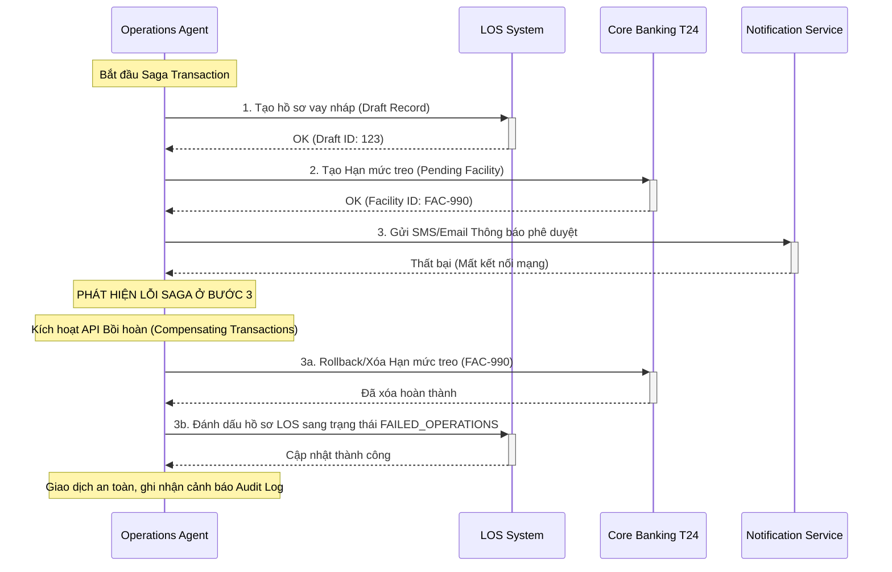

# Tài liệu Kiến trúc Hệ thống Phê duyệt Tín dụng Tự động (Production Spec)

Tài liệu này đặc tả kiến trúc backend và phân cấp Agent ở cấp độ sản xuất (Production-Grade) đối với **Hệ thống Multi-Agent Thẩm định & Phê duyệt Tín dụng Tự động (Automated Credit Appraisal & Loan Approval)** cho Ngân hàng SHB.

---

## 1. KIẾN TRÚC TỔNG QUAN (SYSTEM TOPOLOGY)

Hệ thống được thiết kế theo mô hình **Event-Driven Microservices** phối hợp với **Chains-of-Agents** thông qua một bộ điều phối trạng thái bền bỉ (Stateful Orchestrator).

```
                  ┌──────────────────────────────────────────────┐
                  │          API Gateway (SHB ESB / APIM)        │
                  └──────────────────────┬───────────────────────┘
                                         │
                        [Kafka Event: LOAN_APPLICATION]
                                         │
                                         ▼
                  ┌──────────────────────────────────────────────┐
                  │      Planner Agent (Orchestration Engine)     │
                  └──────┬────────────────────────────────┬──────┘
                         │                                │
      [Parallel Evaluation]                               │
                         │                                │
   ┌─────────────────────┼──────────────────────┐         │ (Veto / Reprice)
   │                     │                      │         │
   ▼                     ▼                      ▼         ▼
┌──────────────┐   ┌──────────────┐   ┌──────────────┐   ┌──────────────┐
│Profile Agent │   │ Credit Agent │   │Product Agent │   │ Legal Agent  │
└──────┬───────┘   └──────┬───────┘   └──────┬───────┘   └──────┬───────┘
       │                  │                  │                  │
       │  ┌───────────────┴──────────────────┴──────────────────┘
       ▼  ▼
┌───────────────────────────────────────────────────────────────┐
│              Risk & Decision Matrix Agent (Gatekeeper)        │
│    - Kiểm tra Veto chính sách                                 │
│    - Gộp Điều kiện giải ngân (Condition Precedents)           │
└──────────────────────┬────────────────────────────────────────┘
                       │
             [Gate Passed: CONDITIONAL_PASS]
                       │
                       ▼
┌───────────────────────────────────────────────────────────────┐
│                 Human Approval Gate (HSM Sign)                │
│    - Giao diện rà soát của Chuyên viên Tín dụng               │
│    - Chữ ký số bảo mật xác nhận cấp tín dụng                  │
└──────────────────────┬────────────────────────────────────────┘
                       │
             [Signed: Token Approved]
                       │
                       ▼
┌───────────────────────────────────────────────────────────────┐
│             Operations Agent (Saga Orchestrator)              │
│    - Ghi nhận LOS | Đồng bộ Core T24 | SMS & Email Thông báo   │
└───────────────────────────────────────────────────────────────┘
```

---

## 2. THIẾT KẾ CÁC SPECIALIST AGENT (PRODUCTION-GRADE AGENT ROLES)

### 2.1. Router & Planner Agent (Bộ điều phối trung tâm)
*   **Hạ tầng:** Xây dựng trên **LangGraph (Python/TypeScript)** sử dụng cơ chế kiểm soát trạng thái tập trung (StateGraph).
*   **Mô hình LLM:** Claude 3.5 Sonnet (độ chính xác suy luận logic cao nhất).
*   **Nhiệm vụ sản xuất:**
    *   Phân loại hồ sơ nhanh (Fast lane) và hồ sơ phức tạp (Complex lane).
    *   Tự động phát hiện xung đột và chạy vòng lặp **Tự động sửa lỗi (Self-Correction Loop)**: Khi Legal Agent phản hồi `VIOLATION` về lãi suất bị ép kèm bảo hiểm (Insurance Tying), Planner sẽ điều hướng lại Product Agent để thực hiện Re-price vô điều kiện trước khi đẩy tiếp sang các bước sau.

### 2.2. Customer Profile Agent (Trích xuất & Xác thực)
*   **Nghiệp vụ cốt lõi:** OCR tài liệu thô (CCCD, Sổ đỏ, Bảng lương) bằng **Google Document AI** $\rightarrow$ Trích xuất thông tin cấu trúc $\rightarrow$ Kiểm tra chéo với CSDL Dân cư Quốc gia (VNeID) và CSDL nội bộ của SHB.
*   **Bảo vệ dữ liệu:** Tích hợp với **Governance Agent** để Tokenize thông tin PII ngay từ đầu vào. Các Agent sau chỉ được đọc ID giao dịch ẩn danh để tránh rò rỉ dữ liệu.

### 2.3. Credit Assessment Agent (Thẩm định tài chính)
*   **Hạ tầng:** Viết bằng code deterministic (TypeScript/Python pure functions). Tuyệt đối không cho phép LLM tự tính số học.
*   **Quy chế thẩm định nội bộ:**
    *   Tính toán DTI stress test tự động với biên độ lãi suất cộng thêm $3.5\% - 5\%$ so với lãi suất ưu đãi hiện hành (mặc định giả lập stress test ở mức 13.5%).
    *   Haircut thu nhập: Lương chuyển khoản qua SHB (haircut 0%), Freelance (haircut 50%), Thu nhập cho thuê tài sản (haircut 30% - giữ lại 70%).
    *   **Công cụ Tự động cấu trúc (Restructure Engine):** Nếu DTI gốc $> 60\%$ hoặc LTV $> 70\%$, chạy giải thuật tối ưu hóa để tìm điểm cân bằng mới (kéo dài kỳ hạn vay tối đa đến 30 năm, hạ hạn mức vay tương ứng LTV $\le 70\%$) để đưa DTI về vùng an toàn $\le 60\%$.

### 2.4. Product Policy Agent (Tra cứu chính sách sản phẩm)
*   **Hạ tầng:** Tích hợp **GraphRAG** kết hợp Vector Database (ChromaDB/PgVector) và Đồ thị tri thức Neo4j chứa toàn bộ chính sách sản phẩm vay của SHB.
*   **Nhiệm vụ:** Ghép cặp thông tin khách hàng (phân khúc, độ tuổi, tài sản) để đề xuất gói vay ưu đãi nhất.

### 2.5. Legal & Compliance Agent (Kiểm soát tuân thủ & Veto Power)
*   **Hạ tầng:** RAG trên cơ sở dữ liệu Luật Các TCTD, Thông tư 39/NHNN, Thông tư 06/NHNN và Sổ tay pháp lý nội bộ SHB.
*   **4 Cổng Kiểm soát Tuân thủ cứng (Compliance Gates):**
    *   *Cổng 1 (Insurance Tying):* Phát hiện hành vi bắt buộc mua bảo hiểm để hưởng lãi suất thấp. Phát tín hiệu `VIOLATION` yêu cầu Planner chạy Re-pricing.
    *   *Cổng 2 (Marital Property):* Đọc thông tin tình trạng hôn nhân. Nếu đã kết hôn, tự động áp điều kiện chặn tại bước ký hợp đồng thế chấp (`blocksAt: CONTRACT_SIGNING`), yêu cầu chữ ký đồng thuận của cả hai vợ chồng.
    *   *Cổng 3 (Future Property Guarantee):* Kiểm tra dự án hình thành trong tương lai dựa trên `projectCode`. Đối chiếu danh mục liên kết của SHB, nếu dự án chưa được SHB cấp phép liên kết bảo lãnh $\rightarrow$ phát tín hiệu `BLOCKED` dừng giải ngân.
    *   *Cổng 4 (Consent Guard):* Kiểm tra trạng thái ký Consent của khách hàng. Nếu thiếu, chặn đứng cuộc gọi API ngoài (như CIC).

### 2.6. Risk & Decision Matrix Agent (Hội đồng phê duyệt số)
*   **Nhiệm vụ:** Nhận toàn bộ `DecisionEnvelope[]` từ các Agent khác. Áp dụng ma trận ưu tiên rủi ro:
    1.  Bất kỳ lỗi `BLOCKER` nào ở trạng thái `APPROVAL` $\rightarrow$ Từ chối hoặc chuyển hàng đợi thủ công (`HUMAN_ESCALATION`).
    2.  Hợp nhất tất cả các lỗi tuân thủ ở mức nhẹ (`CONDITION` ở bước `CONTRACT_SIGNING` hoặc `DISBURSEMENT`) thành danh mục **Điều kiện tiên quyết giải ngân (Condition Precedents)**.

### 2.7. Operations Execution Agent (Tác nghiệp tự động)
*   **Nhiệm vụ:**
    *   Khởi tạo hồ sơ nháp trên hệ thống Quản lý khoản vay (LOS).
    *   Tạo bản ghi hạn mức chờ duyệt (`PENDING_CONDITIONS`) trên Core Banking T24 thông qua kết nối API.
    *   Tự động điền dữ liệu vào biểu mẫu Markdown/PDF **Tờ trình tín dụng** chuẩn của SHB.

### 2.8. Governance & Audit Agent (Đảm bảo an toàn AI)
*   **PII Masking Service:** Áp dụng thuật toán che dữ liệu nhạy cảm cho các trường (CCCD, Phone, Email, Name) trước khi lưu Log hoặc hiển thị Dashboard.
*   **Audit Logger:** Lưu nhật ký giao dịch bất biến (Immutable Audit Events) ghi nhận rõ: Agent nào thực hiện, Tool nào được gọi, Rule ID tương ứng là gì để phục vụ công tác hậu kiểm (Post-audit).
*   **Prompt Injection Scanner:** Quét và cô lập các nội dung chứa mã độc hoặc chỉ thị cố tình vượt quyền AI từ phía tài liệu khách hàng tải lên.

---

## 3. THIẾT KẾ CƠ SỞ DỮ LIỆU ĐỒ THỊ (NEO4J GRAPHRAG ONTOLOGY)

Để Legal Agent soát xét pháp lý hiệu quả, cơ sở dữ liệu đồ thị Neo4j được thiết kế để liên kết mối quan hệ giữa Khách hàng, Tài sản thế chấp, Dự án bất động sản, và Quy định của Ngân hàng Nhà nước.

```
(Customer) --[:OWN]--> (Collateral: Property)
   │                        │
[:DEBTOR_OF]           [:SECURED_BY]
   │                        │
   ▼                        ▼
(LoanAccount) <───[:REGULATE]─── (Regulation: Clause)
   │
[:LOCATED_AT]
   │
   ▼
(Project: PropertyDeveloper)
```

---

## 4. QUY TRÌNH CHỊU LỖI PHÂN TÁN (SAGA PATTERN ORCHESTRATION)

Quy trình phê duyệt khoản vay liên quan đến nhiều hệ thống lõi khác nhau. Operations Agent đóng vai trò là **Saga Orchestrator** để quản lý giao dịch phân tán:



---

## 5. ĐỀ XUẤT CÔNG NGHỆ (PRODUCTION TECH STACK FOR SHB)

*   **Microservices Orchestrator:** **Temporal.io** hoặc **Camunda** (thay thế cho LangGraph ở môi trường production vì khả năng chịu tải, quản lý transaction Saga cực kỳ bền bỉ và dễ viết code bằng Java/TypeScript).
*   **Giao thức kết nối Agent:** **MCP (Model Context Protocol)** trên nền tảng gRPC để đảm bảo tốc độ phản hồi nhanh và bảo mật giữa các microservices.
*   **Database:** 
    *   *Transaction Data:* PostgreSQL (lưu trữ thông tin case, profile).
    *   *Knowledge & Compliance:* **Neo4j** (Graph DB phục vụ GraphRAG).
    *   *Cache:* Redis (lưu trữ Semantic Cache).
*   **AI Infrastructure:** Cài đặt **vLLM** tự host trên máy chủ GPU nội bộ của SHB để chạy các mô hình nguồn mở (Qwen-2.5-14B-Instruct) nhằm tối ưu chi phí và bảo mật tuyệt đối thông tin khách hàng.
